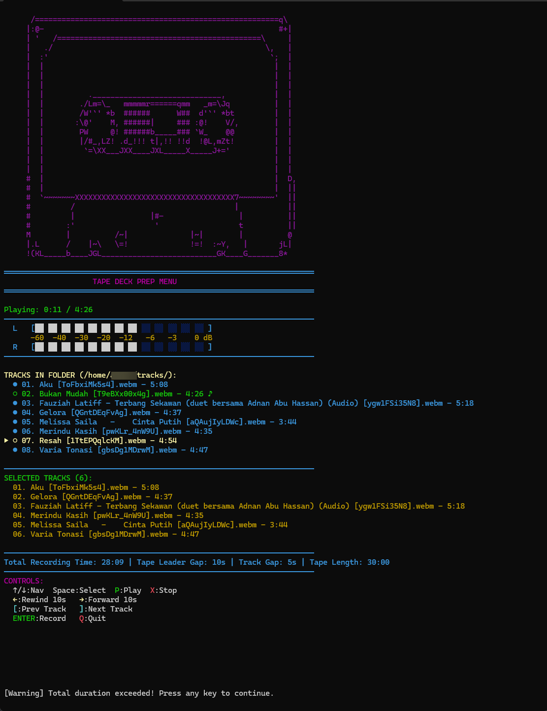
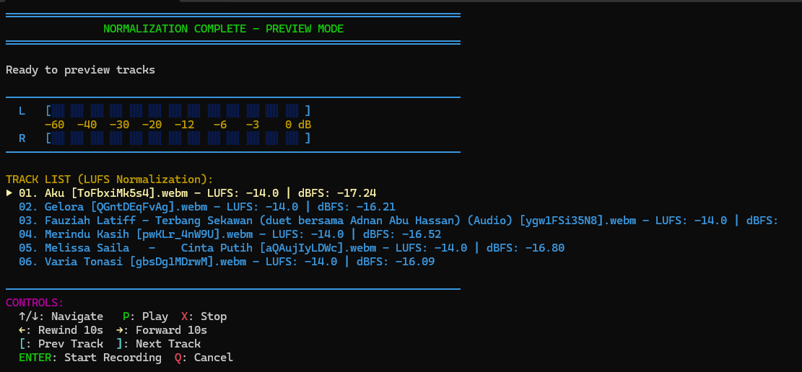
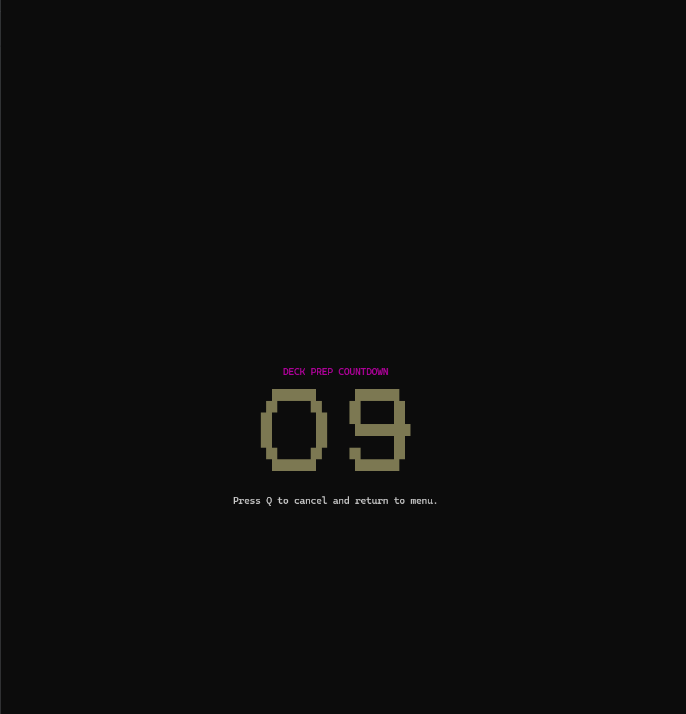
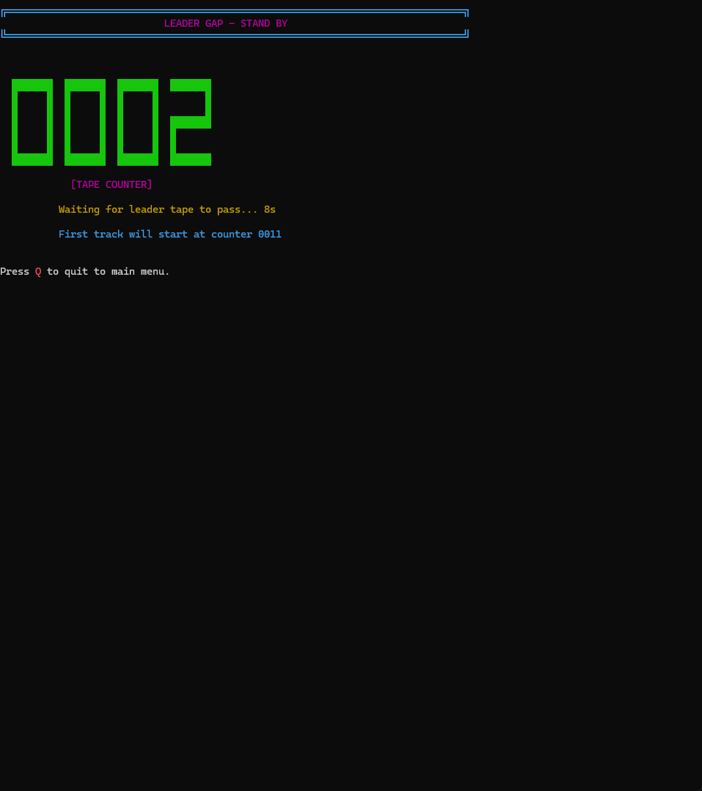
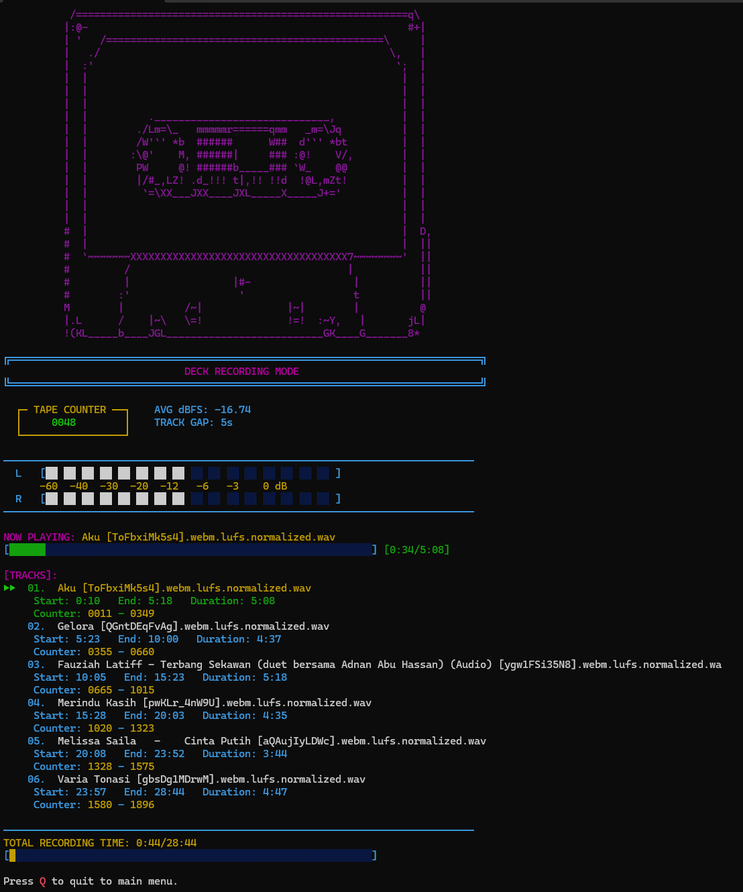
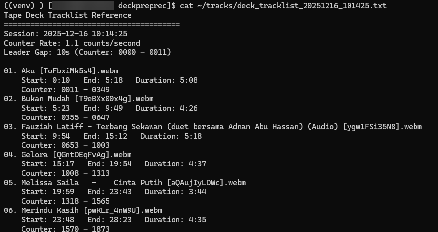

# 📼 Tape Deck/Prep/Record

A nostalgic cassette tape recording utility with. Perfect for mixtapes nerd curated playlists to physical cassette tapes with professional-quality preparation and timing control.

```
 /=======================================================q\
|:@-                                                     #+|
| '   /==============================================\     |
|   ./                                                \,   |
|  :'                                                  `;  |
|  |                                                    |  |
|  |                                                    |  |
|  |                                                    |  |
|  |          ._____________________________,           |  |
|  |        ./Lm=\_   mmmmmr======qmm   _m=\Jq          |  |
|  |        /W'`' *b  ######      W##  d'`' *bt         |  |
|  |       :\@'    M, ######|     ### :@!    V/,        |  |
|  |        PW     @! ######b_____### `W_    @@         |  |
|  |        |/#_,LZ! .d_!!! t|,!! !!d  !@L,mZt!         |  |
|  |         `=\XX___JXX____JXL_____X_____J+='          |  |
|  |                                                    |  |
|  |                                                    |  |
#  |                                                    |  D,
#  |                                                    |  ||
#  `~~~~~~~XXXXXXXXXXXXXXXXXXXXXXXXXXXXXXXXXXXX7~~~~~~~~'  ||
#         /                                    |           ||
#         |                 |#-                 |          ||
#        :'                  '                  t          ||
M        |          /~|              |~|        |          @
|.L      /    |~\   \=!              !=!  :~Y,   |       jL|
!(KL_____b____JGL__________________________GK____G_______8*
```

## ✨ Features

- 🎨 **Retro 80s UI** - Neon colors, ASCII art, and authentic cassette tape aesthetics
- 🔊 **Audio Normalization** - Consistent volume levels across all tracks (cached for speed)
  - Supports both **Peak** and **LUFS** normalization methods
  - LUFS normalization for broadcast-standard perceived loudness
  - Configurable target LUFS level (default: -14.0 LUFS)
- 📟 **4-Digit Tape Counter** - Digital counter with configurable rate matching your deck
- 📊 **Real-Time VU Meters** - Segmented block displays with actual audio waveform analysis (L/R channels)
  - **Persistent display** with dB scale (-60 to 0 dB) always visible
  - Positioned at top of all screens for consistent monitoring
  - Live audio level tracking during playback and recording
- 🎚️ **Adaptive Level Scaling** - 95th percentile RMS normalization prevents constant peaking
- 📼 **Leader Gap Support** - Configurable pre-roll for non-magnetic leader tape
- ⏱️ **Duration Management** - Ensures tracks fit within cassette tape limits
- 🎵 **Advanced Track Preview** - VCR-style playback with seek, play/pause, and track switching
- ⏪ **Seek Controls** - Rewind/forward 10 seconds during playback
- 🎮 **Navigation While Playing** - Browse tracks while music continues in background
- 📝 **Timestamped Tracklists** - Creates unique reference files with counter positions
- ⏸️ **Configurable Track Gaps** - Set silence between tracks
- 🎬 **Large ASCII Art Countdown** - Massive 7-line tall countdown display before recording
- 📈 **Visual Progress Bars** - Real-time progress indicators for both tracks and total recording time
- 🏷️ **Descriptive Labels** - Clear, self-explanatory UI labels (Track Gap, Tape Leader Gap, Total Recording Time, Tape Length)
- 🔧 **Audio Latency Compensation** - Adjustable sync between VU meters and audio output for perfect timing
- 📂 **Folder Path Display** - Shows current working folder in track list header

## 📋 Requirements

- Python 3.12+ (Python 3.13 not supported due to pydub compatibility)
- FFmpeg, FFprobe, FFplay
- pydub library
- curses (windows-curses on Windows)

## 🚀 Installation

### Step 0: Get the Code

First, download or clone the repository:

**Option A: Clone with Git (Recommended)**
```bash
# Install git if you don't have it
# Ubuntu/Debian: sudo apt install git
# Arch/Manjaro: sudo pacman -S git

# Clone the repository
git clone https://github.com/yourusername/deckpreprec.git
cd deckpreprec
```

**Option B: Download ZIP**
1. Click the green "Code" button on GitHub
2. Select "Download ZIP"
3. Extract the ZIP file
4. Open terminal and navigate to the extracted folder:
   ```bash
   cd path/to/deckpreprec
   ```

---

### Option 1: Linux (Recommended)

#### Arch Linux / Manjaro
```bash
# Install dependencies
sudo pacman -S python ffmpeg

# Navigate to project (if not already there)
cd deckpreprec

# Create virtual environment
python -m venv venv
source venv/bin/activate

# Install Python packages
pip install pydub pyloudnorm numpy

# Run the application
python decprec.py
```

#### Ubuntu / Debian
```bash
# Install dependencies
sudo apt update
sudo apt install python3 python3-pip python3-venv ffmpeg

# Create virtual environment
python3 -m venv venv
source venv/bin/activate

# Install Python packages
pip install pydub pyloudnorm numpy

# Run the application
python decprec.py
```

### Option 2: Windows (WSL - Recommended)

Running in WSL provides the best experience and maintains Linux compatibility:

```powershell
# First, get the code (choose one method):

# Method A: Clone in WSL
wsl
git clone https://github.com/yourusername/deckpreprec.git
cd deckpreprec

# Method B: Access downloaded files from Windows
# If you downloaded/extracted to C:\Users\YourUsername\Downloads\deckpreprec
wsl
cd "/mnt/c/Users/YourUsername/Downloads/deckpreprec"

# Then follow Linux installation steps above
```

See [WSL_SETUP.md](WSL_SETUP.md) for detailed WSL instructions.

### Option 3: Windows (Native - Limited Support)

**⚠️ Note:** Script is designed for Linux. Windows native support is limited.

```powershell
# First, download the code:
# Visit GitHub repository and click "Code" > "Download ZIP"
# Extract to a folder like C:\Users\YourUsername\deckpreprec

# Open PowerShell and navigate to the folder
cd C:\Users\YourUsername\deckpreprec

# Install Python 3.12 (NOT 3.13)
# Download from: https://www.python.org/downloads/

# Install FFmpeg
winget install --id Gyan.FFmpeg -e
# OR download from: https://www.gyan.dev/ffmpeg/builds/

# Create virtual environment
python -m venv .venv
.venv\Scripts\Activate.ps1

# Install dependencies
pip install windows-curses pydub pyloudnorm numpy

# Run the application (must specify ffmpeg.exe location on Windows)
# Find where FFmpeg is installed (common locations):
# - C:\ffmpeg\bin\ffmpeg.exe
# - C:\Program Files\ffmpeg\bin\ffmpeg.exe
# - C:\Users\YourUsername\ffmpeg\bin\ffmpeg.exe

python decprec.py --ffmpeg-path "C:\ffmpeg\bin\ffmpeg.exe"
```

## 📖 Usage

### Basic Usage

```bash
python decprec.py
```

### Advanced Options

```bash
python decprec.py --folder ./tracks --track-gap 5 --duration 60 --counter-rate 1.0 --leader-gap 10
```

**Arguments:**
- `--folder PATH` - Audio tracks directory (default: `./tracks`)
- `--track-gap N` - Gap between tracks in seconds (default: `5`)
- `--duration N` - Maximum tape duration in minutes (default: `30`)
- `--counter-rate N` - Counter increments per second (default: `1.0`)
- `--leader-gap N` - Leader gap before first track in seconds (default: `10`)
- `--normalization METHOD` - Normalization method: `peak` or `lufs` (default: `lufs`)
- `--target-lufs N` - Target LUFS level for LUFS normalization (default: `-14.0`)
- `--audio-latency N` - Audio latency compensation in seconds for VU meter sync (default: `0.0`, try `0.1-0.5` if audio lags behind meters)
- `--ffmpeg-path PATH` - Path to ffmpeg binary (default: `/usr/bin/ffmpeg`). Use this on Windows to point to your `ffmpeg.exe` location

### Supported Audio Formats

MP3, WAV, FLAC, WebM, M4A, AAC, OGG

### Folder Structure

```
deckpreprec/
├── decprec.py
├── tracks/                    # Your audio files go here
│   ├── song1.mp3
│   ├── song2.wav
│   ├── song3.flac
│   ├── normalized/            # Auto-generated normalized files
│   │   ├── song1.mp3.lufs.normalized.wav    # LUFS normalized
│   │   ├── song1.mp3.peak.normalized.wav    # Peak normalized
│   │   └── song2.wav.lufs.normalized.wav
│   ├── deck_tracklist_20241211_143022.txt  # Timestamped tracklists
│   └── deck_tracklist_20241211_151545.txt
├── venv/                      # Virtual environment
└── README.md
```

## 🎹 Keyboard Controls

### Main Menu (Track Selection)
| Key | Action |
|-----|--------|
| `↑` / `↓` | Navigate tracks (keeps current track playing) |
| `Space` | Select/deselect track for recording |
| `P` | Play/Pause track (toggle playback) |
| `X` | Stop playback and reset position |
| `←` / `→` | Rewind/Forward 10 seconds (while playing) |
| `[` / `]` | Jump to previous/next track and play |
| `Enter` | Start recording process |
| `Q` | Quit application |

### Normalization Preview Mode
| Key | Action |
|-----|--------|
| `↑` / `↓` | Navigate tracks (keeps current track playing) |
| `P` | Play/Pause track (toggle playback) |
| `X` | Stop playback and reset position |
| `←` / `→` | Rewind/Forward 10 seconds (while playing) |
| `[` / `]` | Jump to previous/next track and play |
| `Enter` | Proceed to recording |
| `Q` | Return to main menu |

### Recording Mode
| Key | Action |
|-----|--------|
| `Q` | Return to main menu |

## 🎯 Workflow

1. **Launch Application**
   ```bash
   python decprec.py
   ```

2. **Select Tracks**
   - Navigate with arrow keys (↑/↓)
   - Preview tracks with `P` key (play/pause toggle)
   - **VU meters display at top with dB scale** - always visible
   - Use `←`/`→` to rewind/forward 10 seconds while playing
   - Use `[`/`]` to quickly jump between tracks
   - Press `Space` to select/deselect tracks for recording
   - Monitor total duration and folder path in header
   - Real-time playback position displayed

3. **Start Recording Process**
   - Press `Enter` when tracks are selected
   - Wait for normalization (LUFS or Peak method, cached for subsequent runs)
   - Review normalized tracks with level info (LUFS/dBFS values)
   - **Preview with persistent VU meters** showing audio levels in real-time
   - Full playback controls available during preview

4. **Deck Preparation**
   - Press `Enter` to start **large ASCII art countdown** (7 lines tall)
   - Set your cassette deck to RECORD mode
   - Watch the massive countdown numbers
   - Can cancel with `Q` if needed

5. **Recording**
   - Leader gap countdown (default 10s for non-magnetic tape)
   - Tape counter starts at 0000 during leader gap
   - First track starts after leader gap
   - **Monitor real-time VU meters at top** (L/R channels with dB scale)
   - **Visual progress bars** for current track and total recording time
   - Watch tape counter and track progress
   - Timestamped tracklist saved automatically

6. **Reference Your Tracklist**
   - Check `tracks/deck_tracklist_YYYYMMDD_HHMMSS.txt` for:
     - Session timestamp
     - Leader gap counter range
     - Track start/end times
     - Counter positions
     - Track durations

## 📸 Screenshots

### Main Menu - Track Selection

*Browse and select tracks. Preview is also available*

### Track Preview and Normalization summary

*Preview tracks order and normalization value*

### Prep Countdown

*10-second countdown*

### Leader Gap Countdown

*leader gap countdown to pass the record head*

### Recording Mode with VU Meters

*Real-time VU meters, tape counter, and track progress*

### Tracklist Output

*Real-time VU meters, tape counter, and track progress*

## 🎨 UI Design Details

- **Neon Color Scheme:** Cyan, magenta, yellow, green, red, white
- **ASCII Cassette Art:** Authentic tape graphics in menu and recording mode
- **Digital Counter Display:** 4-digit LED-style counter with real-time updates
- **Segmented VU Meters:** Block character displays (██) with full dB scale (-60 to 0 dB)
  - Always visible at top of screen during all modes
  - Real-time stereo channel monitoring (L/R)
  - Color-coded zones for visual feedback
- **Dynamic Color Zones:** White (0-85%) → Red (85-100%) peak indicators
- **Waveform Analysis:** Pre-computed RMS levels with 50ms chunk resolution
- **Retro Box Drawing:** Double-line borders and frames (╔═╗╚╝)
- **Large ASCII Art Countdown:** Massive 7-line tall numbers with blink effect
- **Progress Bars:** Color-coded bars (█ and ░) for track and total time
- **Track Preview Indicator:** Musical note (♪) symbol for playing tracks
- **Clear Labels:** Descriptive text throughout (no cryptic abbreviations)

## 📝 Configuration Tips

### Tape Counter Rate

Match your deck's counter behavior:
```bash
# If counter reaches 60 after 1 minute
python decprec.py --counter-rate 1.0

# If counter reaches 120 after 1 minute
python decprec.py --counter-rate 2.0

# Custom rate (e.g., 1.1)
python decprec.py --counter-rate 1.1
```

### Leader Gap Configuration

Adjust leader gap for non-magnetic tape at beginning:
```bash
# Short leader (5 seconds)
python decprec.py --leader-gap 5

# Standard leader (10 seconds - default)
python decprec.py --leader-gap 10

# Long leader (15 seconds)
python decprec.py --leader-gap 15
```

### Normalization Methods

Choose between peak and LUFS normalization:
```bash
# LUFS normalization (default) - broadcast standard, consistent perceived loudness
python decprec.py --normalization lufs --target-lufs -14.0

# Peak normalization - maximizes amplitude
python decprec.py --normalization peak

# Custom LUFS target (e.g., for louder output)
python decprec.py --normalization lufs --target-lufs -12.0
```

### Audio Latency Compensation

Sync VU meters with audio output (useful in WSL or with audio buffering):
```bash
# No compensation (default)
python decprec.py --audio-latency 0.0

# Delay meters by 0.2 seconds to match audio lag
python decprec.py --audio-latency 0.2

# Fine-tune for perfect sync (try 0.1-0.5)
python decprec.py --audio-latency 0.3
```

### Common Tape Lengths

```bash
# C60 cassette (30 minutes per side)
python decprec.py --duration 30

# C90 cassette (45 minutes per side)
python decprec.py --duration 45

# C120 cassette (60 minutes per side)
python decprec.py --duration 60
```

### Complete Example

Full configuration for a C90 tape with LUFS normalization and latency compensation:
```bash
python decprec.py \
  --folder ~/tracks \
  --duration 45 \
  --track-gap 5 \
  --leader-gap 10 \
  --counter-rate 1.1 \
  --normalization lufs \
  --target-lufs -14.0 \
  --audio-latency 0.2
```

## 🐛 Troubleshooting

### Python 3.13 Compatibility Error
```
ModuleNotFoundError: No module named 'audioop'
```
**Solution:** Use Python 3.12 or earlier. Python 3.13 removed the `audioop` module.

### FFmpeg Not Found
```
RuntimeWarning: Couldn't find ffmpeg or avconv
```
**Solution:** Install FFmpeg and ensure it's in your PATH.

### No Audio Tracks Found
**Solution:** Place audio files in the `tracks/` folder.

### Curses Issues on Windows
**Solution:** Use WSL or install `windows-curses`:
```bash
pip install windows-curses
```

### LUFS Normalization Not Available
```
ERROR: LUFS normalization requires pyloudnorm
```
**Solution:** Install pyloudnorm for LUFS support:
```bash
pip install pyloudnorm
```
Or use peak normalization instead:
```bash
python decprec.py --normalization peak
```

### VU Meters Not Syncing with Audio
**Symptom:** VU meters appear to move before or after the actual sound

**Solution:** Use audio latency compensation to sync meters with output:
```bash
# If meters are ahead of audio (common in WSL)
python decprec.py --audio-latency 0.2

# Adjust value between 0.1-0.5 until perfectly synced
python decprec.py --audio-latency 0.3
```

## 📄 License

MIT License

## 🤝 Contributing

Contributions welcome! Feel free to submit issues or pull requests.

## 🙏 Acknowledgments

- Inspired by classic tape deck recording workflows
- 80s home recording studio aesthetics
- Mixtape culture and physical media preservation

---

**Made with 💜 for cassette tape enthusiasts**
